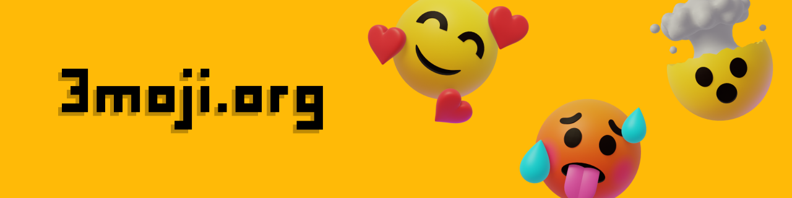

# 3moji 3D Library

  

3moji is my attempt at creating a 3D Emoji library. The project is a current work in progress but it is slowly getting better day by day.

The best way to currently view the 3moji library is over at:

🔗https://3moji.org/

If you do start to use 3moji in a project you should know that there could definitely be some small errors like flipped normals or incorrect scaling. If you find something let me know at info@3moji.org! It Helps me make the library better.

I'd also love to see what you're building so feel free to share anything you make! 😄

**3moji 3D Library Includes**
- FBX
- GLTF
- GLB
- PNG (256x256)
- CSV (file of mapped names and Unicode characters)

**Skintone**

I plan to write up better documentation but for now this know how to adjust the libraries skin tone.

Models with skin tone options have a material called skin_tone_one or skin_tone_two, by offsetting the UV coordinates you can shift the texture and pick between the five skin tones Unicode has listed.

🏿 UV offset: 0.25, 🏾UV offset: 0.2, 🏽UV offset: 0.15, 🏼UV offset:  0.1, 🏻 UV offset: 0.05

**License**

3moji 3D Library is licensed under:

